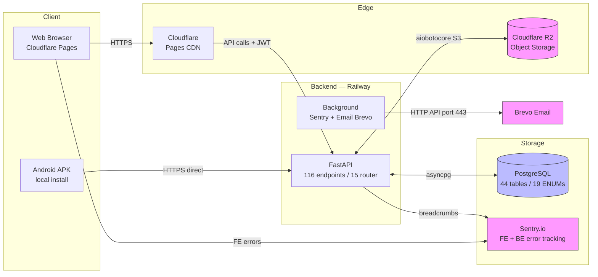
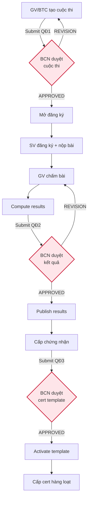

# PTIT Contest — Hệ thống quản lý cuộc thi sinh viên

[](https://ptit-contest-mobile-app-production.up.railway.app/api/docs)
[](https://ptit-contest-app.pages.dev)
[](08-database/)
[](#trạng-thái)

Đề tài Công nghệ phần mềm (CNPM) HK2 2026 — Học viện Công nghệ Bưu chính Viễn thông (PTIT). Hệ thống full-stack quản lý cuộc thi sinh viên với 4 vai trò: Sinh viên / GV BTC / BCN khoa / Quản trị, workflow phê duyệt 3 cấp, deploy production thực tế (Railway BE + Cloudflare Pages FE + APK Android).

---

## Truy cập nhanh

| Resource | URL |
|----------|-----|
| **Web app (production)** | https://ptit-contest-app.pages.dev |
| **API (Swagger UI)** | https://ptit-contest-mobile-app-production.up.railway.app/api/docs |
| **Backend repo** | [`09-implementation/backend/`](09-implementation/backend/) |
| **Frontend repo** | [`09-implementation/frontend/`](09-implementation/frontend/) |
| **Báo cáo CNPM** | [`11-docs/deliverables/2026-05-07_bao-cao-cnpm_v02.md`](11-docs/deliverables/2026-05-07_bao-cao-cnpm_v02.md) |

**Tài khoản demo** (mật khẩu đặt qua env `DEMO_PASSWORD`, mặc định `abc123` — seed tự động bởi `seed-demo.py` + `seed-rich.py` khi chạy Docker):
- `b22dccn001@ptit.edu.vn` — Sinh viên
- `gv@ptit.edu.vn` — GV/BTC (JUDGE + ORGANIZER)
- `bcn@ptit.edu.vn` — Ban Chủ nhiệm khoa (HOD)
- `admin@ptit.edu.vn` — Quản trị

---

## Trạng thái

| Hạng mục | v1.0 (2026-05-10) |
|----------|-------------------|
| Backend FastAPI | **116 endpoints** qua 15 router module · 44 SQLAlchemy models · 44 bảng PostgreSQL (faculty_cert_templates Sprint 25) |
| Frontend Flutter | **35+ screens** responsive web/mobile · APK Android 25.9 MB |
| 4 actor end-to-end | ✅ SV / GV-BTC / BCN-HOD / Admin (strict role separation Sprint 15) |
| Workflow phê duyệt 3 cấp | ✅ QĐ1 (BCN duyệt contest) · QĐ2 (BCN duyệt kết quả) · QĐ3 (BCN duyệt cert template) |
| Production foundation | ✅ Sentry FE+BE · Rate limit · Refresh token · Email Brevo HTTP · HSTS A+ · R2 file storage |
| WCAG 2.1 AA | ✅ Touch ≥44dp · Reduce-motion · Skeleton theme-aware shimmer (Sprint 26) · Semantics deep wrap (axe-core 0 violations) |
| Light + Dark theme | ✅ Material 3 · 484 theme tokens · OKLCH 9-stop brand ramp |
| Biometric login (APK) | ✅ FaceID/TouchID + refresh token rotation |
| Login UX | ✅ 2-column branding + 6 quote rotator có author + role tab autofill + split-outward animation 750ms |
| Navigation | ✅ Pattern B collapse 240↔64 sidebar 4 role · Browser back/forward · F5 reload preserve URL · Deep-link share `?to=` |

**Production URL deploy cuối**: `627e134a.ptit-contest-app.pages.dev` (alias `ptit-contest-app.pages.dev`)

---

## Tính năng chính

### Sinh viên
- Đăng nhập qua password / OTP 6-box / biometric (APK) / SSO PTIT (Coming soon)
- Onboarding 3 slides lần đầu mở app
- Khám phá cuộc thi — search, filter, hero "SỰ KIỆN NỔI BẬT"
- Đăng ký cá nhân hoặc theo team với leader assignment
- Submit bài làm (text/link/file ≤10MB upload R2) + countdown timer hết hạn
- Theo dõi tiến độ "Của tôi" với progress bar 5 stage (Chờ duyệt → Đã đăng ký → Đang dự thi → Đã kết thúc)
- Bảng xếp hạng podium top-3 (gold/silver/bronze) + table rank với "BẠN" highlight
- Nhận chứng nhận điện tử có QR verify
- Profile achievement stats (Cuộc thi / Giải thưởng / Chứng nhận)
- Notifications time-bucket (Hôm nay / Tuần này / Cũ hơn)

### GV / Ban tổ chức
- Tạo contest 3 chế độ INDIVIDUAL/TEAM/HYBRID
- Quản lý rounds + sessions + scoring criteria
- Submit BCN duyệt (QĐ1) trước khi mở đăng ký
- Phê duyệt entries cá nhân/team
- Assign judges + Open/Blind judging
- Chấm điểm với hero card "Hôm nay cần chấm" + filter scored vs unscored
- Compute results + submit BCN duyệt (QĐ2) + publish
- Activate cert template + cấp cert hàng loạt
- Export Excel báo cáo cuộc thi

### Ban Chủ nhiệm khoa (BCN)
- Phê duyệt 3 lane: Đề xuất cuộc thi (QĐ1) / Kết quả cuộc thi (QĐ2) / Cert template (QĐ3)
- Bulk approve entries (productivity ~30x)
- Giám sát tiến độ contest realtime
- Approve/reject với note + revision request

### Quản trị
- Quản lý user + role assignment
- Quản lý faculty/major/class master data
- Cấu hình hệ thống (system_configs)
- Backup & Restore database
- Audit log với filter user/action/contest/time range
- Anomaly detection report
- Bình luận moderation
- System health monitor (API/DB/R2)
- Export báo cáo tổng hệ thống xlsx

---

## Architecture



### Workflow phê duyệt 3 cấp



---

## Tech stack

### Backend (`09-implementation/backend/`)
- **Python 3.11+** · **FastAPI** · **SQLAlchemy 2.0 async** · **asyncpg**
- **PostgreSQL 14+** · **Alembic** baseline migration
- **Pydantic v2** · **JWT HS256** + refresh token rotation · **bcrypt**
- **Sentry** error tracking · **Brevo HTTP API** email · **Cloudflare R2** S3-compat object storage
- **slowapi** rate limit · **openpyxl** xlsx export
- Deploy: Railway auto via git push, Dockerfile cache-friendly

### Frontend (`09-implementation/frontend/`)
- **Flutter 3.27** · **Dart 3.6** · **Material 3** + 484 theme tokens
- **Riverpod 2.6** state · **Dio** HTTP · **GoRouter** navigation
- **Sentry FE** error tracking · **Shimmer** skeleton loading
- **local_auth** biometric (APK only) · **shared_preferences** persist UI state
- **google_fonts** Plus Jakarta Sans + JetBrains Mono · **intl** date format
- Deploy web: Cloudflare Pages manual via `build_deploy.ps1` (wrangler)
- Deploy mobile: APK Android local `flutter build apk` (KGP 2.2.0 + AGP 8 + Java 17)

### Database (`08-database/`)
- PostgreSQL schema `ptit_contest` — 44 bảng + 19 ENUM types
- ER diagram Mermaid: `2026-05-04_er-diagram_v02.mermaid`
- Schema thiết kế: `2026-05-04_sqlapp_v03.sql` (artifact); schema runtime thực tế là `09-implementation/backend/init-schema.sql` (v04, baseline `0001`) + các Alembic migration sau đó (vd `0002_faculty_cert_templates`)

---

## Cấu trúc folder

```
12-cnpm-project/
├── README.md                    ← file này (overview)
├── 01-research/                 ← user research, persona, competitor analysis
├── 02-requirements/             ← đề cương + traceability matrix v03 (104 endpoints + UI mapping)
├── 03-information-architecture/ ← workflow phê duyệt 3 cấp QĐ1+QĐ2+QĐ3
├── 05-mockups/                  ← high-fi UI screens (4 HTML actor + React JSX 8350 dòng)
├── 06-design-system/            ← style guide + UI-UX Pro Max skill
├── 08-database/                 ← schema SQL v04 + ER diagram Mermaid
├── 09-implementation/           ← code production
│   ├── backend/                 ← FastAPI + SQLAlchemy (116 endpoints)
│   └── frontend/                ← Flutter web + APK (35+ screens)
├── 11-docs/                     ← tài liệu dự án
│   ├── deliverables/            ← báo cáo CNPM + slide bảo vệ + phân công
│   ├── audits/                  ← audit reports (code/design/ux/a11y)
│   ├── sprints/                 ← sprint notes + checklists
│   └── roadmap/                 ← lộ trình + hướng phát triển
└── 99-archive/                  ← version cũ (v01, v02...)
```

---

## Lịch sử Sprint (highlights)

| Phase | Sprint | Highlights |
|-------|--------|------------|
| Foundation | Phase 1 | Sentry · Rate limit · Refresh token · Email Brevo · HSTS A+ |
| Quick wins | Phase 2 Sprint 1 | Notification deep-link · Bulk approve · Excel export · Biometric · Skeleton |
| UX audit + tokens | Phase A + B + C | 4 token files · 24/24 screen audit · WCAG 0 violations |
| Audit + fix | Sprint 8-12 | DB/BE/FE smoke test · 11 bug fix · 6 endpoint mới wire UI · contest stats |
| Design folder | Sprint 13-18 | 14 items P1+P2+P3 từ design mockup · 2 endpoint mới (rounds + leaderboard) |
| Login redesign | Sprint 19 | Web 2-column branding · Onboarding 3 slides · OTP 6-box · Sidebar collapsible Pattern B (VS Code/Sentry style) |
| Dashboard redesign | Sprint 20-22 | SV grouped sidebar + 3 hero · GV/BCN dashboard rich (4 stat + 2-col + donut chart CustomPaint) · Pattern B collapse 240↔64 |
| Real-time stats | Sprint 23-25 | 4 endpoint `/reports/*` · Donut wire data thật · GV activity feed terminal log · 7 placeholder screens build thật · Cert template CRUD (1 Alembic migration) |
| Polish | Sprint 26-27 | Theme-aware shimmer + stagger fade-in · 6 quote rotator có author (Lenin/Mandela/...) · Role tab autofill credentials |
| Login animation + nav hotfixes | Sprint 28 | Split-outward 750ms · 4 nav hotfix (didUpdateWidget reset · 7 slug allow-list · splash `?to=` preserve URL) · E2E Chrome MCP 7/7 |

Chi tiết từng sprint xem **báo cáo CNPM v02**: [`11-docs/deliverables/2026-05-07_bao-cao-cnpm_v02.md`](11-docs/deliverables/2026-05-07_bao-cao-cnpm_v02.md) (~1610 dòng, 28 sprint).

---

## Setup local dev

### Demo nhanh bằng Docker (clone-and-run) — khuyên dùng

Một lệnh dựng cả Frontend + Backend + **PostgreSQL chạy chung trong cùng dự án** (không cần cài DB riêng). Schema, migration và dữ liệu mẫu phong phú đều tự động:

```bash
cd 09-implementation
docker compose up -d --build
# Web :8080 · API :8000/api/docs · DBGate :4224 · DBX :4225 · Postgres :5432
```

DB tự khởi tạo `init-schema.sql` v04 → `alembic stamp 0001 → upgrade head`, rồi nạp **2 lớp seed nối tiếp** (`seed-demo.py` nền + `seed-rich.py` làm giàu: 5 khoa · ~17 SV · 6 cuộc thi gồm cả cuộc thi đã kết thúc có chứng nhận & bảng xếp hạng · đánh giá/Q&A/bài viết/audit). Cả hai idempotent. Mật khẩu demo = `DEMO_PASSWORD` (mặc định `abc123`). Chi tiết: [`README-DEMO.md`](README-DEMO.md).

### Backend (chạy thủ công, không Docker)

```bash
cd 09-implementation/backend
python -m venv .venv
source .venv/bin/activate    # Windows: .venv\Scripts\activate
pip install -e ".[dev]"
cp .env.example .env         # Sửa DATABASE_URL + JWT_SECRET_KEY

# Tạo DB + init schema v04 (giống Docker) rồi apply Alembic migration
psql -U postgres -c "CREATE DATABASE ptit_contest_db;"
psql -U postgres -d ptit_contest_db -f init-schema.sql
alembic stamp 0001_baseline_v04   # stamp baseline RỒI upgrade để áp 0002+ (faculty_cert_templates)
alembic upgrade head

# Seed dữ liệu demo (nền + làm giàu) — idempotent
DEMO_PASSWORD=abc123 python scripts/seed-demo.py
DEMO_PASSWORD=abc123 python scripts/seed-rich.py

# Run dev
uvicorn app.main:app --reload --port 8000
```

→ http://localhost:8000/api/docs

### Frontend

```bash
cd 09-implementation/frontend
flutter pub get

# Run web dev
flutter run -d chrome \
  --dart-define=API_BASE=https://ptit-contest-mobile-app-production.up.railway.app

# Build production web (Cloudflare Pages)
./build_deploy.ps1   # PowerShell Windows

# Build APK Android
flutter build apk --release \
  --dart-define=API_BASE=https://ptit-contest-mobile-app-production.up.railway.app
```

---

## Triển khai (deployment)

| Layer | Platform | Method | Frequency |
|-------|----------|--------|-----------|
| **Backend** | Railway | Git push → auto deploy | Mỗi khi merge BE diff |
| **Frontend Web** | Cloudflare Pages | `wrangler pages deploy` qua `build_deploy.ps1` | Mỗi khi merge FE diff |
| **APK Android** | Local file | `flutter build apk --release` | Theo release schedule |

Order: Backend trước → Frontend sau (FE phụ thuộc API mới của BE) → APK cuối.


## Liên kết tham chiếu

- **Báo cáo CNPM**: [`11-docs/deliverables/2026-05-07_bao-cao-cnpm_v02.md`](11-docs/deliverables/2026-05-07_bao-cao-cnpm_v02.md) — đầy đủ chương 1-6 (~1610 dòng, 28 sprint)
- **Traceability matrix**: [`02-requirements/2026-05-07_traceability-matrix_v03.md`](02-requirements/) — 104 endpoint mapping với UI screens
- **Workflow approval 3 cấp**: [`03-information-architecture/2026-05-04_workflow-approval-overview_v01.md`](03-information-architecture/)
- **Audit reports**: [`11-docs/audits/audit-report-2026-05-06.md`](11-docs/audits/audit-report-2026-05-06.md) · [`design-audit-2026-05-06.md`](11-docs/audits/design-audit-2026-05-06.md) · [`a11y-baseline-2026-05-07.md`](11-docs/audits/a11y-baseline-2026-05-07.md)
